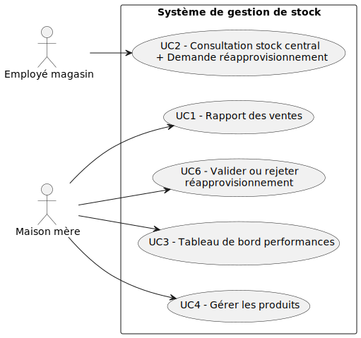
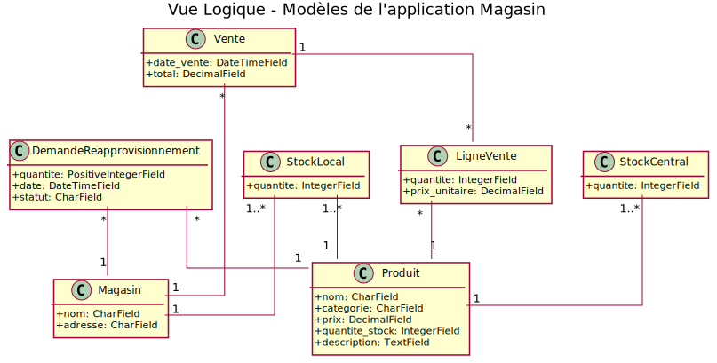
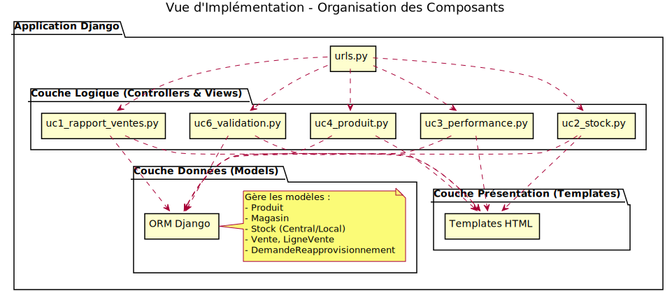
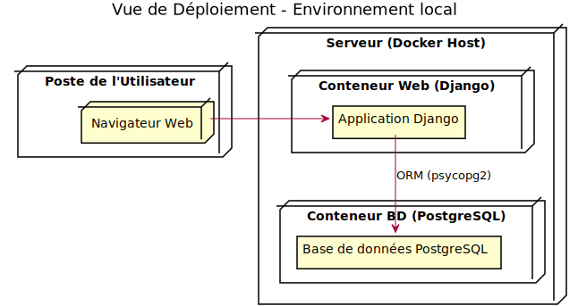
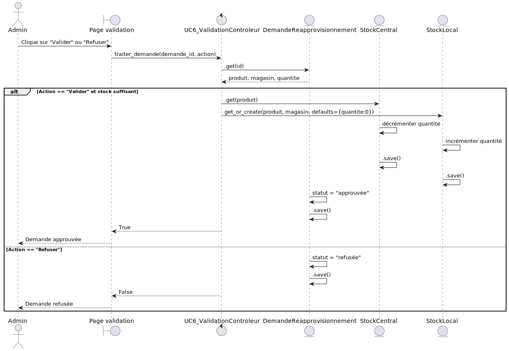
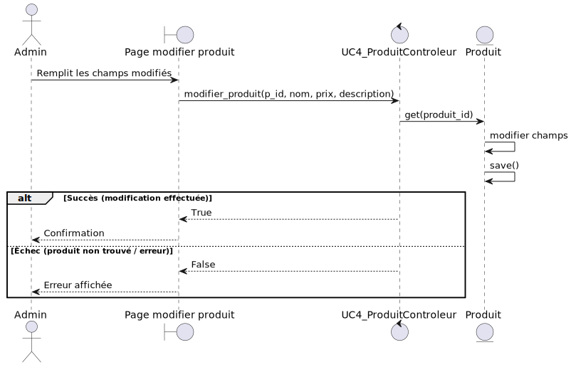

# Rapport Architecture ARC42 - Système Multi-Magasins (Labs 1 et 2 - LOG430)

**Auteur :** Talip Koyluoglu  
**Date :** 21 juin 2025  
**Projet :** Système de Gestion Multi-Magasins  
**Repository GitHub :** 
- [Labo 0](https://github.com/TalipKoyluoglu/LOG430-Lab0)
- [Labo 1](https://github.com/TalipKoyluoglu/LOG430-Lab1)
- [Labo 2](https://github.com/TalipKoyluoglu/LOG430-Labo2)

---

## 1. Introduction et Objectifs

### 1.1 Aperçu du Système

Ce rapport documente la transformation d'un système de caisse console simple (Lab 1) vers une application web multi-magasins (Lab 2), avec architecture modulaire et déployable via Docker.

### 1.2 Objectifs Architecturaux

#### Objectifs fonctionnels :
- **Gestion Multi-Magasins :** Centraliser la supervision des ventes et des stocks de plusieurs magasins.
- **Gestion des Stocks :** Permettre aux employés de consulter le stock central et de soumettre des demandes de réapprovisionnement.
- **Rapports Stratégiques :** Fournir aux gestionnaires des rapports consolidés sur la performance des ventes.
- **Gestion des Produits :** Permettre à la maison-mère de gérer le catalogue de produits (création, modification).

#### Objectifs non-fonctionnels (Attributs de Qualité) :
- **Maintenabilité :** Assurer une architecture modulaire (MVC) permettant des modifications et des ajouts de fonctionnalités avec un effort prévisible.
- **Déployabilité :** Garantir un déploiement fiable et reproductible sur n'importe quel environnement grâce à la conteneurisation Docker.
- **Scalabilité :** Concevoir le système pour qu'il puisse supporter l'ajout de nouveaux magasins sans nécessiter de refactoring majeur de l'architecture.
- **Performance :** Assurer un temps de réponse rapide pour les opérations critiques comme l'enregistrement d'une vente et la génération de rapports.
- **Disponibilité :** Isoler les composants pour que la défaillance d'un service (ex: un magasin) n'entraîne pas l'arrêt complet du système.

### 1.3 Parties Prenantes

| Rôle              | Responsabilités                   | Préoccupations                          |
|-------------------|------------------------------------|------------------------------------------|
| Gestionnaire      | Supervision globale, apprivisionnement des magasins               | Rapports stratégiques                    |
| Employé           | Ventes et gestion de stock         | Rapidité et fluidité de l'interface      |
| Développeur       | Maintenance, test, déploiement     | Modularité, dette technique              |

---

## 2. Contraintes

### 2.1 Techniques

- Framework : Django (avec ORM intégré)
- Base de données : PostgreSQL
- Conteneurisation : Docker
- Tests : Pytest, couverture UC1 à UC6

### 2.2 Organisationnelles

- Livraison répartie sur 2 laboratoires (Labo 1 + Labo 2)
- Réutilisation de certaines logique du labo 1
- Déploiement reproductible

### 2.3 Contraintes d'Évolution (Passage de Lab 1 à 2)

- **Éléments à Conserver :**
  - La logique métier de base pour le calcul des ventes.
  - Les modèles de données initiaux (`Produit`, `Vente`) qui ont servi de fondation.

- **Éléments à Modifier :**
  - **Architecture :** Passage d'une architecture 2-tiers (console + BD) à une architecture 3-tiers (navigateur + serveur Django + BD).
  - **Gestion du Stock :** Évolution d'un stock unique vers un `StockCentral` et des `StockLocal` distincts.
  - **Persistance des Données :** Remplacement des requêtes SQL directes par l'ORM Django pour une meilleure abstraction et sécurité.

- **Éléments à Ajouter :**
  - **Interface Utilisateur :** Création d'une interface web complète avec des templates HTML.
  - **Structure MVC :** Introduction de `views`, `controllers`, et `urls.py` pour organiser le code.
  - **Gestion des Réapprovisionnements :** Ajout du système de création et de validation des demandes.
  - **Déploiement :** Conteneurisation avec Docker et mise en place d'un pipeline CI/CD.

---

## 3. Contexte Métier

### 3.1 Domaine

Système de caisse et supervision multi-magasins, avec possibilité de gestion centralisée des stocks et tableaux de bord analytiques.

### 3.2 Évolution Lab 1 à Lab 2

- **Lab 1 :** Application console 2-tiers avec PostgreSQL.
- **Lab 2 :** Application web 3-tiers Django, MVC, Dockerisé.

### 3.3 Contraintes d'Évolution (Passage de Lab 1 à 2)

- **Éléments à Conserver :**
  - La logique métier de base pour le calcul des ventes.
  - Les modèles de données initiaux (`Produit`, `Vente`) qui ont servi de fondation.

- **Éléments à Modifier :**
  - **Architecture :** Passage d'une architecture 2-tiers (console + BD) à une architecture 3-tiers (navigateur + serveur Django + BD).
  - **Gestion du Stock :** Évolution d'un stock unique vers un `StockCentral` et des `StockLocal` distincts.
  - **Persistance des Données :** Remplacement des requêtes SQL directes par l'ORM Django pour une meilleure abstraction et sécurité.

- **Éléments à Ajouter :**
  - **Interface Utilisateur :** Création d'une interface web complète avec des templates HTML.
  - **Structure MVC :** Introduction de `views`, `controllers`, et `urls.py` pour organiser le code.
  - **Gestion des Réapprovisionnements :** Ajout du système de création et de validation des demandes.
  - **Déploiement :** Conteneurisation avec Docker et mise en place d'un pipeline CI/CD.

---

## 4. Stratégie de Solution

### 4.1 Architecture Cible

- Architecture **3-tiers** (Frontend / Backend / DB)
- **MVC Django**
- Tests automatisés : unitaires, intégration, e2e
- Pipeline CI/CD GitHub Actions
- Données initiales via `initial_data.json`

### 4.2 Approche Domain-Driven Design (DDD)

Pour guider la structure de notre application, nous avons adopté une approche DDD afin de modéliser le système autour de son domaine métier. Nous avons identifié les sous-domaines suivants :

**1. Domaine Principal (Core Domain) : Gestion des Ventes**
- **Description :** C'est le cœur de l'application, ce qui lui apporte sa valeur principale. Il gère tout le cycle de vie d'une transaction commerciale.
- **Contexte Délimité (Bounded Context) :** Ventes
- **Langage Ubiquitaire :** `Vente`, `LigneVente`, `Produit`, `Total`, `Date de Vente`.
- **Composants Architecturaux :**
  - **Modèles :** `Vente`, `LigneVente`
  - **Contrôleurs :** `uc1_rapport_ventes.py`, `uc3_performance.py` (pour l'analyse des ventes)

**2. Domaine de Support (Supporting Domain) : Logistique et Stock**
- **Description :** Ce domaine supporte le domaine principal. Sans une bonne gestion des stocks, il ne peut y avoir de ventes.
- **Contexte Délimité (Bounded Context) :** Logistique
- **Langage Ubiquitaire :** `StockCentral`, `StockLocal`, `DemandeReapprovisionnement`, `Quantité`, `Statut`.
- **Composants Architecturaux :**
  - **Modèles :** `StockCentral`, `StockLocal`, `DemandeReapprovisionnement`, `Produit`, `Magasin`
  - **Contrôleurs :** `uc2_stock.py`, `uc6_validation.py`

**3. Domaine Générique (Generic Domain) : Gestion des Produits**
- **Description :** C'est une fonctionnalité nécessaire mais non différenciante (un "problème résolu"). La gestion d'un catalogue de produits est une tâche standard.
- **Contexte Délimité (Bounded Context) :** Catalogue
- **Langage Ubiquitaire :** `Produit`, `Nom`, `Prix`, `Catégorie`, `Description`.
- **Composants Architecturaux :**
  - **Modèles :** `Produit`
  - **Contrôleurs :** `uc4_produit.py`

Cette séparation en domaines a directement influencé la structure des répertoires et la séparation des responsabilités dans le code, comme le montre la Vue d'Implémentation.

---

## 5. Vue Architecturale

Cette section présente l'architecture du système à travers une série de vues complémentaires, basées sur le modèle 4+1. Chaque diagramme illustre un aspect spécifique de l'architecture.

### 5.1 Vue des Cas d'Utilisation

**Référence :** `docs/UML/vue-cas-utilisation.puml`

Ce diagramme identifie les acteurs du système (Employé, Admin) et les fonctionnalités principales qu'ils utilisent. Il donne un aperçu de haut niveau de ce que le système permet de faire.

### 5.2 Vue Logique

**Référence :** `docs/UML/vue-logique.puml`

Cette vue représente le modèle de domaine du système. Elle montre les classes de données principales (Produit, Vente, Stock, etc.), leurs attributs et les relations qui les unissent. C'est le schéma conceptuel de notre application.

### 5.3 Vue d'Implémentation

**Référence :** `docs/UML/vue-implementation.puml`

Ce diagramme montre comment le code source est organisé en composants. Il illustre la structure MVC de Django avec les répertoires `models`, `views`, `controllers` et `templates`, et montre comment ils interagissent.

### 5.4 Vue de Déploiement

**Référence :** `docs/UML/vue-deploiement.puml`

Cette vue décrit l'architecture physique sur laquelle le système est déployé. Elle montre les conteneurs Docker (Application Web, Base de Données) et comment ils sont hébergés et communiquent entre eux.

### 5.5 Vue des Processus (Diagrammes de Séquence)

Ces diagrammes illustrent comment les composants interagissent au fil du temps pour réaliser un cas d'utilisation spécifique.

**Création d'une demande de réapprovisionnement :**
*Référence : `docs/UML/DSS-créer-demande-apprivisionnement.puml`*
 

**Validation d'une demande de réapprovisionnement :**
*Référence : `docs/UML/DSS-valider-demande-apprivisionnement.puml`*
 

**Modification d'un produit :**
*Référence : `docs/UML/DSS-modifierProduit.puml`*
 

---

## 6. Concepts Transversaux

Cette section aborde les aspects qui ne sont pas limités à un seul composant, mais qui s'appliquent à l'ensemble du système.

### 6.1 Sécurité
- **Validation des Données :** La validation des entrées est effectuée côté serveur dans les vues Django pour prévenir les injections de données invalides.
- **Protection ORM :** L'utilisation de l'ORM Django protège nativement contre les attaques par injection SQL, car il génère et échappe les requêtes de manière sécurisée.
- **Limites :** Le système ne dispose pas actuellement d'un mécanisme d'authentification ou de gestion des autorisations. L'accès aux différentes fonctionnalités n'est pas restreint par rôle, ce qui constitue une vulnérabilité majeure (voir section Risques).

### 6.2 Performance
- **Pool de Connexions :** La base de données PostgreSQL, gérée via Docker, utilise un système de pool de connexions pour réutiliser les connexions existantes et réduire la latence lors des requêtes.
- **Requêtes Optimisées :** L'ORM permet d'utiliser des stratégies de chargement comme `select_related` et `prefetch_related` (bien que non systématiquement utilisées ici) pour minimiser le nombre de requêtes SQL pour les opérations complexes.

### 6.3 Observabilité
- **Logging :** L'application Django est configurée avec le système de logging par défaut. Les erreurs et les événements importants sont tracés et peuvent être consultés via les logs du conteneur Docker (`docker-compose logs web`).
- **Monitoring :** Le monitoring se limite actuellement à la supervision de l'état des conteneurs via la CLI Docker. Aucun outil de monitoring applicatif (APM) n'est en place.

---

## 7. Tests

- 3 classes de tests :
  - `test_unitaires.py`
  - `test_integration.py`
  - `test_e2e.py`
- Chargement automatique via `conftest.py`
- Tests fonctionnels UC1 à UC6
- Exécutés via `docker-compose run` ou dans pipeline

---

## 8. ADRs (Architectural Decision Records)

### ADR-001 : Adoption de la structure MVC (Model-View-Controller) avec Django

**Contexte**

Django repose sur une architecture proche du modèle MVC, bien qu'il nomme différemment certains composants (View = Template, Controller = View). Il est essentiel de structurer l'application de manière modulaire, cohérente et claire pour refléter les cas d'utilisation du système de gestion de magasin.

**Décision**

J'ai choisi d'adopter la structure MVC implicite de Django :
- **Models** : définis dans `magasin/models`, responsables des entités persistées (Produit, Magasin, Stock, etc.)
- **Views (contrôleurs)** : définies dans `magasin/views`, déclenchant les traitements métier
- **Templates (vues utilisateurs)** : dans `magasin/templates`, pour générer le HTML

**Raisons**

- Alignement naturel avec la structure Django
- Meilleure séparation des responsabilités entre persistance, logique métier et interface
- Favorise les tests unitaires et l'évolution modulaire du code
- Clarifie les cas d'utilisation via des vues distinctes (UC1, UC2, etc.)

**Conséquences**

- Respect strict du découplage Modèle / Vue / Contrôleur
- Intégration facilitée avec les tests (contrôleurs testables indépendamment)
- Possibilité d'étendre la logique métier dans des fichiers `controllers/` dédiés

---

### ADR-002 : Adoption de l'ORM intégré de Django pour la gestion de la persistance

**Contexte**

L'application nécessite un accès fiable et structuré à une base de données PostgreSQL. Django inclut un ORM complet permettant de mapper les classes Python vers des tables SQL tout en offrant un niveau d'abstraction élevé.

**Décision**

J'ai décidé d'utiliser exclusivement l'ORM Django pour la gestion de la persistance :
- Les modèles (`Produit`, `Magasin`, `Vente`, etc.) sont définis dans `magasin/models/`
- Les requêtes sont exprimées en Python (ex. `Produit.objects.filter(...)`)
- Les migrations sont gérées automatiquement (`makemigrations`, `migrate`)

**Raisons**

- Réduction massive du code SQL manuel
- Sécurité renforcée via protection contre l'injection SQL
- Génération automatique du schéma et des migrations
- Intégration naturelle avec les tests via les fixtures et bases de test temporaires
- Productivité accrue et lisibilité améliorée

**Conséquences**

- Tous les accès aux données passent par les modèles Django
- La cohérence des données est assurée via des validations côté modèle
- Le chargement initial des données (`initial_data.json`) est compatible avec l'ORM

**Alternatives considérées**

- Accès SQL brut via `psycopg2` : rejeté pour complexité et risques de sécurité
- Utilisation de SQLAlchemy : incompatible avec Django sans configuration complexe

---

## 9. Scénarios de Qualité

Cette section traduit les objectifs de qualité en scénarios concrets et mesurables.

### Scénario 1 : Maintenabilité - Ajout d'une nouvelle fonctionnalité

- **Source :** Un développeur de l'équipe.
- **Stimulus :** La direction demande d'ajouter une nouvelle page qui liste les 5 produits les moins vendus par magasin.
- **Artefact :** Le code source de l'application.
- **Environnement :** En cours de développement.
- **Réponse :** Le développeur doit :
  1. Créer une nouvelle méthode dans le contrôleur approprié (`uc1_rapport_ventes.py`).
  2. Ajouter une nouvelle route dans `urls.py`.
  3. Créer un nouveau template HTML pour afficher la liste.
  4. La modification est réalisée sans impacter les fonctionnalités existantes.
- **Mesure de la Réponse :** Le développement, les tests unitaires et l'intégration de cette nouvelle fonctionnalité doivent prendre **moins de 3 heures de travail**.

### Scénario 2 : Déployabilité - Mise en place d'un nouvel environnement

- **Source :** Un nouvel employé (développeur) rejoint l'équipe.
- **Stimulus :** Le nouvel employé a besoin de lancer une instance locale complète de l'application sur son poste de travail.
- **Artefact :** Le repository Git du projet.
- **Environnement :** Un poste de travail avec Docker et Git installés.
- **Réponse :** L'employé clone le repository, puis exécute une seule commande (`docker-compose up`). Le système démarre, la base de données est initialisée avec les données de `initial_data.json`, et l'application est accessible dans son navigateur.
- **Mesure de la Réponse :** Le temps entre la fin du `git clone` et le moment où l'application est fonctionnelle doit être **inférieur à 5 minutes**, sans aucune intervention manuelle de configuration.

---

## 10. Risques et Dette Technique

### 10.1 Risques Techniques Identifiés

- **RISK-001 : Absence de Mécanisme d'Authentification et d'Autorisation**
  - **Description :** N'importe qui ayant accès à l'URL peut accéder à toutes les fonctionnalités, y compris celles de gestion.
  - **Probabilité :** Élevée (dans un contexte de production).
  - **Impact :** Critique. Compromission totale des données de vente et de stock.
  - **Stratégie de Mitigation :** Implémenter le module d'authentification de Django avec gestion des permissions par groupe (ex: "Employé", "Gestionnaire").

- **RISK-002 : Performance des Rapports sur de Grands Volumes de Données**
  - **Description :** La génération de rapports qui agrègent des mois ou des années de ventes pourrait devenir très lente à mesure que la base de données grossit.
  - **Probabilité :** Moyenne.
  - **Impact :** Moyen. L'interface de reporting pourrait devenir inutilisable.
  - **Stratégie de Mitigation :** Mettre en place un système de cache (ex: avec Redis) pour les rapports fréquemment consultés ou pré-calculer les statistiques durant les heures creuses via des tâches planifiées.

### 10.2 Dette Technique

- **DEBT-001 : Couverture de Tests Insuffisante**
  - **Description :** Les tests actuels (unitaires, intégration, e2e) se concentrent sur les "happy paths" et ne couvrent pas suffisamment les cas d'erreur (ex: stock insuffisant lors de la validation, données de formulaire invalides).
  - **Urgence :** Moyenne.
  - **Effort estimé pour résolution :** 2 jours-homme.
  - **Impact :** Risque de régressions non détectées lors de l'ajout de nouvelles fonctionnalités.

- **DEBT-002 : Manque de Validation Front-end**
  - **Description :** La validation des formulaires se fait uniquement côté serveur. L'utilisateur n'a pas de retour immédiat si les données saisies sont incorrectes.
  - **Urgence :** Faible.
  - **Effort estimé pour résolution :** 1 jour-homme.
  - **Impact :** Expérience utilisateur dégradée, allers-retours inutiles avec le serveur.

---

## 11. Glossaire

### Termes Métier
| Terme | Signification |
|---|---|
| Magasin | Point de vente physique avec son propre stock local. |
| Maison Mère | L'entité centrale qui gère les produits et supervise les magasins. |
| Réapprovisionnement | Le processus de demander et de transférer du stock du dépôt central vers un magasin. |
| Stock Central | Le stock principal de produits géré par la maison mère. |
| Stock Local | Le stock de produits disponible dans un magasin spécifique. |
| UC (Use Case) | Un cas d'utilisation, représentant une fonctionnalité métier (ex: UC1 - Rapport des ventes). |

### Termes Techniques
| Terme | Signification |
|---|---|
| ADR | Architectural Decision Record : Document qui justifie une décision d'architecture. |
| CI/CD | Continuous Integration / Continuous Deployment : Automatisation des tests et du déploiement. |
| Conteneurisation | Empaqueter une application et ses dépendances dans une image (ex: Docker). |
| DDD | Domain-Driven Design : Une approche de conception logicielle centrée sur le domaine métier. |
| MVC | Model-View-Controller : Un patron d'architecture pour organiser le code en trois parties. |
| ORM | Object-Relational Mapping : Technique qui convertit les tables d'une base de données en objets utilisables en code. |
| 3-Tier | Architecture à 3 niveaux (Présentation / Logique Applicative / Données). |

---

## Conclusion

Ce système reflète une progression maîtrisée vers une architecture distribuée Django MVC, couplée à une pipeline CI/CD robuste, un usage rigoureux de DDD, et une qualité logicielle assurée par les tests et le déploiement conteneurisé.
